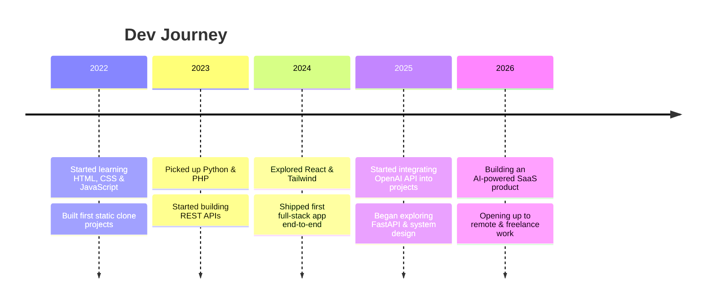
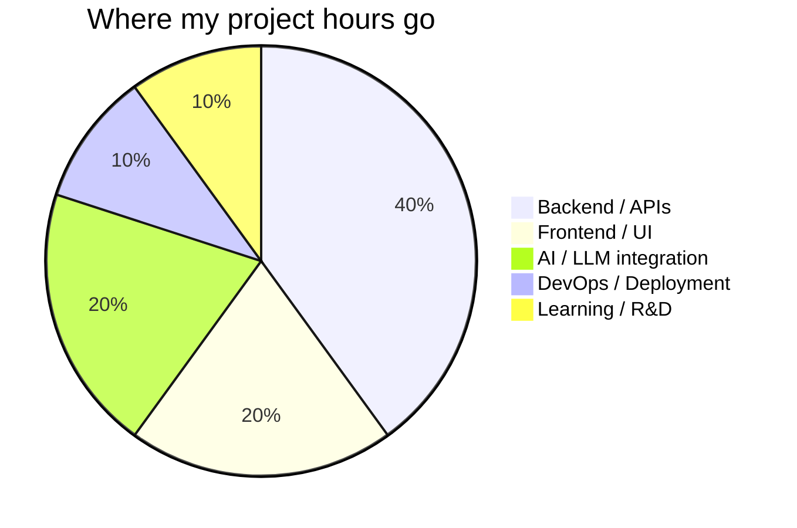
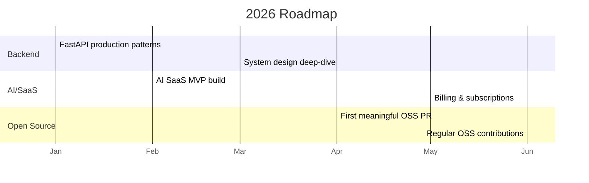
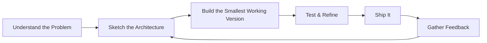
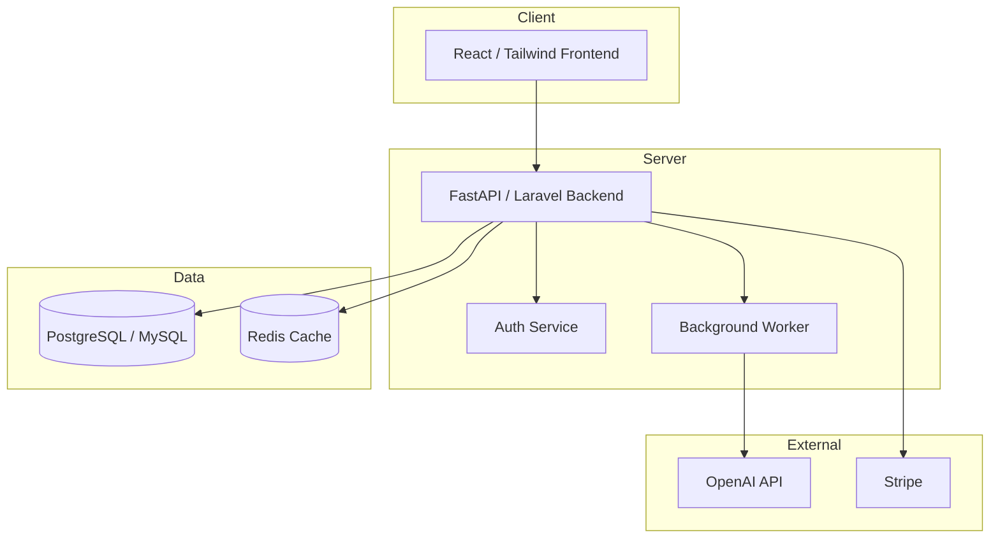

<!-- ============================================================ -->
<!--  KHALID ZIYA KHAN — GITHUB PROFILE README                    -->
<!--  Repo: github.com/Shan786123/Shan786123                      -->
<!-- ============================================================ -->

<div align="center">

<!-- Animated typing header -->
<a href="https://git.io/typing-svg">
  
</a>

<br/>

<!-- Top badge row -->


<br/><br/>


</div>

---

## 📑 Table of Contents

- [👋 About Me](#-about-me)
- [⚡ Quick Status](#-quick-status)
- [🧠 What I Bring to the Table](#-what-i-bring-to-the-table)
- [🛠️ Tech Stack](#️-tech-stack)
  - [Languages](#languages)
  - [Frontend](#frontend)
  - [Backend & APIs](#backend--apis)
  - [Databases](#databases)
  - [AI / ML / SaaS](#ai--ml--saas)
  - [DevOps, Cloud & Tools](#devops-cloud--tools)
  - [Testing & Quality](#testing--quality)
- [📊 Skill Proficiency](#-skill-proficiency)
- [🧭 Currently Learning](#-currently-learning-roadmap)
- [🔄 How I Work](#-how-i-work)
- [🚀 Featured Projects](#-featured-projects)
- [📈 GitHub Analytics](#-github-analytics)
- [🐍 Contribution Snake](#-contribution-snake)
- [⌨️ Weekly Coding Activity](#️-weekly-coding-activity)
- [✍️ Latest Blog Posts](#️-latest-blog-posts)
- [🏆 Certifications & Achievements](#-certifications--achievements)
- [🎓 Education](#-education)
- [🌐 Open Source & Community](#-open-source--community)
- [🖥️ My Setup](#️-my-setup)
- [💬 Testimonials](#-testimonials)
- [❓ FAQ](#-faq)
- [☕ Support My Work](#-support-my-work)
- [🤝 Let's Work Together](#-lets-work-together)
- [🏢 Companies & Clients](#-companies--clients-ive-worked-with)
- [🧾 Quick Snapshot](#-quick-snapshot)
- [📬 Connect With Me](#-connect-with-me)
- [📡 Follow My Work](#-follow-my-work)
- [🔖 Legend](#-appendix-legend)
- [📄 License](#-license)

---

## 👋 About Me

I'm **Khalid Ziya Khan**, a Full-Stack Developer who builds web apps that actually work — clean backends, sharp frontends, and everything glued together in between. I work primarily with **Python**, **PHP**, and modern **APIs** to ship SaaS products, AI-powered tools, and scalable web applications.

I care about writing code that **solves real problems**, not just code that compiles. I like small, well-tested increments over big-bang rewrites, and I'd rather ship something useful today than something perfect next quarter.

<table>
<tr>
<td>

**🧑‍💻 Role**
Full-Stack Developer

**🌍 Location**
India (IST, UTC +5:30)

**🗣️ Languages I Speak**
English, Hindi, Urdu

</td>
<td>

**📦 Currently Building**
AI-powered SaaS tool (Python + OpenAI API)

**🌱 Currently Learning**
System design & FastAPI deployment

**💬 Ask Me About**
Python, PHP, REST APIs, SaaS architecture

</td>
</tr>
</table>

> *"First, solve the problem. Then, write the code."*

### 🕰️ My Journey So Far



### 🎯 My Philosophy

- **Ship, then polish.** A working v1 beats a perfect plan.
- **Read the error message.** Most bugs explain themselves if you slow down.
- **APIs are contracts.** Design them like someone else has to trust them — because they do.
- **Boring technology wins.** I reach for the proven tool before the trendy one, unless the trendy one clearly solves a real constraint.

### 🌱 Interests Outside Code

- Exploring how AI tooling changes day-to-day developer workflows
- Reading about SaaS pricing models and indie-hacker case studies
- Tinkering with self-hosted tools and home-lab style side projects

---

## ⚡ Quick Status

```text
🔭 Building        : AI-powered SaaS tool with Python + OpenAI API
🌱 Learning         : System design & FastAPI deployment
💬 Ask me about     : Python, PHP, REST APIs, SaaS architecture
📫 Reach me at      : khalidziyakhan.dev@gmail.com
⚡ Fun fact         : I've cloned YouTube before breakfast
🎯 2026 Goal        : Ship 3 production SaaS tools & contribute to open source
```

---

## 🧠 What I Bring to the Table

- 🔹 **End-to-end ownership** — comfortable across the stack, from database schema to pixel-perfect UI
- 🔹 **API-first mindset** — I design backends as clean, documented, reusable services
- 🔹 **AI integration experience** — building tools on top of the OpenAI API and similar LLM providers
- 🔹 **Pragmatic problem solving** — I optimize for shipping working software, then iterating
- 🔹 **Clear communication** — comfortable working async with remote teams and clients

### 🔍 Why Work With Me

| You need... | I bring... |
|---|---|
| A backend that won't fall over | Typed, validated APIs with sensible error handling |
| Someone who can also touch the frontend | Comfortable in React + Tailwind, not just backend-only |
| Fast iteration on an AI feature | Practical experience wiring LLM APIs into real products |
| Clear updates, not silence | Regular, concise progress check-ins |

### 💻 A Typical Session

```bash
$ git clone https://github.com/Shan786123/project.git
$ cd project
$ python -m venv venv && source venv/bin/activate
$ pip install -r requirements.txt
$ uvicorn app.main:app --reload
INFO:     Uvicorn running on http://127.0.0.1:8000
INFO:     Application startup complete.
```

---

## 🛠️ Tech Stack

### Languages

<p>


</p>

### Frontend

<p>


</p>

### Backend & APIs

<p>


</p>

### Databases

<p>


</p>

### AI / ML / SaaS

<p>


</p>

### DevOps, Cloud & Tools

<p>


</p>

### Testing & Quality

<p>


</p>

---

## 📊 Skill Proficiency

| Skill | Level | Progress |
|---|---|---|
| Python | Advanced | ████████████████░░░░ 80% |
| PHP | Advanced | ███████████████░░░░░ 75% |
| JavaScript | Intermediate–Advanced | █████████████░░░░░░░ 65% |
| REST API Design | Advanced | ████████████████░░░░ 80% |
| MySQL | Advanced | ███████████████░░░░░ 75% |
| React | Intermediate | ███████████░░░░░░░░░ 55% |
| FastAPI | Intermediate | ████████████░░░░░░░░ 60% |
| Docker | Intermediate | ██████████░░░░░░░░░░ 50% |
| OpenAI API / LLM tooling | Intermediate–Advanced | ██████████████░░░░░░ 70% |
| System Design | Learning | ████████░░░░░░░░░░░░ 40% |
| Docker Compose | Intermediate | ██████████░░░░░░░░░░ 50% |
| Git / GitHub workflows | Advanced | ███████████████░░░░░ 75% |
| Tailwind CSS | Intermediate–Advanced | █████████████░░░░░░░ 65% |
| Laravel | Intermediate | ███████████░░░░░░░░░ 55% |
| PostgreSQL | Intermediate | ██████████░░░░░░░░░░ 50% |
| Stripe / Payments integration | Intermediate | █████████░░░░░░░░░░░ 45% |

<sub>Self-assessed and updated periodically — not a formal certification scale.</sub>

### Time Split by Domain



---

## 🧭 Currently Learning / Roadmap

- [x] Core Python & PHP fundamentals
- [x] Building REST APIs from scratch
- [x] Integrating third-party APIs (weather, OpenAI, payments)
- [x] Responsive frontend layouts with Tailwind
- [ ] FastAPI production deployment (Docker + Nginx + CI/CD)
- [ ] System design fundamentals (caching, load balancing, queues)
- [ ] Contributing to a large open-source codebase
- [ ] Shipping a multi-tenant SaaS product end-to-end

### 2026 Plan at a Glance



---

## 🔄 How I Work



I try to keep the loop short: understand → sketch → build → test → ship → learn → repeat. Most of my projects start as a rough working prototype before they get polished.

### 🏗️ Typical SaaS Architecture I Reach For



### 🧪 Code Style Sample

A small taste of how I like to structure an API endpoint — typed, validated, and easy to test:

```python
from fastapi import APIRouter, HTTPException
from pydantic import BaseModel

router = APIRouter(prefix="/api/v1/tasks", tags=["tasks"])


class TaskCreate(BaseModel):
    title: str
    priority: int = 1


class TaskOut(TaskCreate):
    id: int
    completed: bool = False


@router.post("/", response_model=TaskOut, status_code=201)
async def create_task(payload: TaskCreate) -> TaskOut:
    if not payload.title.strip():
        raise HTTPException(status_code=422, detail="Title cannot be empty")

    task = await task_service.create(payload)
    return task
```

---

## 🚀 Featured Projects

### 🌤️ Weather App
A clean, real-time weather application fetching live data via a public weather API. Includes city search, current conditions, and a simple responsive layout.

**Built with:** `HTML` `CSS` `JavaScript`

<p>


</p>

[🔗 View Repo](https://github.com/Shan786123/weather_app)

---

### 🎬 YouTube Clone
A functional YouTube-style UI built from scratch, including layout, search bar, sidebar navigation, and video cards, focused on matching the real interaction patterns of the original.

**Built with:** `HTML` `CSS`

<p>


</p>

[🔗 View Repo](https://github.com/Shan786123/youtubeclone)

---

### 🎓 Apna College Clone
A frontend replica of an educational platform's landing experience, focused on responsive design and clean, semantic structure.

**Built with:** `HTML` `CSS`

<p>


</p>

[🔗 View Repo](https://github.com/Shan786123/apna_clg)

---

### 💼 Portfolio Site
My personal portfolio — projects, skills, and contact information, all in one place, built to be fast and easy to update.

**Built with:** `HTML` `CSS` `JavaScript`

<p>


</p>

[🔗 View Repo](https://github.com/Shan786123/shanPortfolio)

---

<div align="center">

<sub>📌 More projects — including the current AI/SaaS build — are being added as they reach a shareable state. Pin your best repos on your GitHub profile so they surface above this section too.</sub>

</div>

### 📋 Case Study Format (used for bigger builds)

For larger projects, I like documenting them in a consistent shape so anyone skimming the repo understands the "why," not just the "what":

| Section | What it covers |
|---|---|
| **Problem** | What situation or pain point triggered the build |
| **Approach** | Why this architecture/stack over the alternatives considered |
| **Challenges** | What actually went wrong, and how it was resolved |
| **Outcome** | What shipped, and what it enabled (metrics if available) |
| **What I'd do differently** | Honest retrospective — no project is perfect |

<details>
<summary>Example: AI-Powered SaaS Tool (in progress)</summary>

- **Problem:** [Describe the real problem the tool solves]
- **Approach:** FastAPI backend, OpenAI API for the AI layer, PostgreSQL for persistence, Stripe for billing
- **Challenges:** [e.g., managing LLM response latency, prompt reliability, cost control]
- **Outcome:** [Fill in once shipped — users, usage stats, feedback]
- **What I'd do differently:** [Honest retrospective note]

<sub>📌 Placeholder — replace with real specifics once the project is further along.</sub>

</details>

---

## 📈 GitHub Analytics

<div align="center">


</div>

<div align="center">


<br/>


<br/>


<br/>


</div>

---

## 🐍 Contribution Snake

<div align="center">

<!-- Uncomment once the GitHub Action from github.com/Platane/snk is set up on this repo -->
<!--

-->

<sub>🐍 Not set up yet — see the workflow below to enable an animated snake that "eats" your contribution graph.</sub>

</div>

<details>
<summary>⚙️ GitHub Action to enable the snake animation</summary>

```yaml
# .github/workflows/snake.yml
name: Generate Snake

on:
  schedule:
    - cron: "0 0 * * *"
  workflow_dispatch: {}
  push:
    branches:
      - main

jobs:
  generate:
    permissions:
      contents: write
    runs-on: ubuntu-latest
    steps:
      - uses: Platane/snk@v3
        with:
          github_user_name: Shan786123
          outputs: |
            dist/github-contribution-grid-snake.svg
            dist/github-contribution-grid-snake-dark.svg?palette=github-dark
      - uses: crazy-max/ghaction-github-pages@v3
        with:
          target_branch: output
          build_dir: dist
        env:
          GITHUB_TOKEN: ${{ '{{' }} secrets.GITHUB_TOKEN {{ '}}' }}
```

Once this workflow runs once, uncomment the `` tag above pointing at the `output` branch.

</details>

---

## ⌨️ Weekly Coding Activity

<!--START_SECTION:waka-->
```text
From WakaTime (auto-updates once the waka-readme-stats action is configured):

Python       ████████████░░░░░░░░░░░░   45.2 hrs
PHP          ████████░░░░░░░░░░░░░░░░   28.6 hrs
JavaScript   █████░░░░░░░░░░░░░░░░░░░   18.1 hrs
HTML/CSS     ███░░░░░░░░░░░░░░░░░░░░░   11.4 hrs
Other        ██░░░░░░░░░░░░░░░░░░░░░░    6.3 hrs
```
<!--END_SECTION:waka-->

<details>
<summary>⚙️ How to make this section auto-update</summary>

1. Create a free [WakaTime](https://wakatime.com) account and install the plugin for your editor.
2. Add the [`anmol098/waka-readme-stats`](https://github.com/anmol098/waka-readme-stats) GitHub Action to this repo.
3. Store your WakaTime API key as a repo secret (`WAKATIME_API_KEY`).
4. The action will automatically replace the content between the `waka` comment markers above on a schedule.

</details>

---

## ✍️ Latest Blog Posts

<!--START_BLOG-POST_LIST-->
- 📝 *Connect a dev.to or Medium RSS feed here using the [`gautamkrishnar/blog-post-workflow`](https://github.com/gautamkrishnar/blog-post-workflow) GitHub Action to auto-populate this list.*
<!--END_BLOG-POST_LIST-->

<details>
<summary>⚙️ How to enable auto-updating blog posts</summary>

```yaml
# .github/workflows/blog-post-workflow.yml
name: Latest blog post workflow
on:
  schedule:
    - cron: "0 */12 * * *"
  workflow_dispatch: {}
jobs:
  update-readme-with-blog:
    runs-on: ubuntu-latest
    steps:
      - uses: actions/checkout@v4
      - uses: gautamkrishnar/blog-post-workflow@master
        with:
          feed_list: "https://dev.to/feed/YOUR_USERNAME"
```

</details>

---

## 🏆 Certifications & Achievements

| Certification / Achievement | Issuer | Year |
|---|---|---|
| [Certification name] | [Issuing organization] | 20XX |
| [Certification name] | [Issuing organization] | 20XX |
| [Hackathon / competition result] | [Event name] | 20XX |

<sub>📌 Template row — replace with your real certifications (Coursera, freeCodeCamp, AWS, hackathon wins, etc.).</sub>

### 🔄 Currently In Progress

| Course / Certification | Provider | Expected Completion |
|---|---|---|
| [Course name] | [Provider] | 20XX-QX |

---

## 🎓 Education

```text
🎓 [Degree / Course Name]
   [Institution Name] · [Start Year] – [End Year]
   [Optional: relevant coursework, GPA, honors]

🏫 [Earlier School / Diploma, if relevant]
   [Institution Name] · [Start Year] – [End Year]
```

<sub>📌 Template — fill in with your actual education details.</sub>

---

## 🏢 Companies & Clients I've Worked With

<p align="center">


</p>

<sub>📌 Template row — replace with real client/company names once you're able to share them publicly.</sub>

---

## 🌐 Open Source & Community

- 🔹 Actively looking to contribute to open-source Python and PHP projects
- 🔹 Interested in AI-tooling and developer-experience repos
- 🔹 Happy to review PRs, write docs, or pair on small features for projects I use

<p>


</p>

---

## 🖥️ My Setup

<details>
<summary>Click to see the tools I work in day-to-day</summary>

| Category | Tool |
|---|---|
| OS | [Your OS — e.g. Ubuntu / Windows + WSL2] |
| Editor | VS Code |
| Terminal | [Your terminal — e.g. Windows Terminal / iTerm2] |
| Browser | [Your browser] |
| API Testing | Postman |
| Version Control | Git + GitHub |
| Note-taking | [Notion / Obsidian / etc.] |
| Music while coding | [Optional — lo-fi, playlists, etc.] |

<sub>📌 Template — fill in with your real day-to-day tools.</sub>

</details>

---

## 💬 Testimonials

<details>
<summary>💼 "[Client / collaborator name]" — [Company / Role]</summary>
<br>

> "[Add a real quote here from a client, collaborator, or teammate about working with you.]"

</details>

<details>
<summary>💼 "[Client / collaborator name]" — [Company / Role]</summary>
<br>

> "[Add another real testimonial here.]"

</details>

<details>
<summary>💼 "[Client / collaborator name]" — [Company / Role]</summary>
<br>

> "[Add a third testimonial — from a hackathon teammate, freelance client, or code reviewer.]"

</details>

<details>
<summary>💼 "[Client / collaborator name]" — [Company / Role]</summary>
<br>

> "[Add a fourth testimonial here, or remove this block if you don't have one yet.]"

</details>

<sub>📌 Template section — replace with real feedback once you have some collected. A couple of genuine quotes are worth more than several placeholders left unfilled.</sub>

---

## ❓ FAQ

<details>
<summary>What kind of projects are you looking for?</summary>
<br>
Freelance or remote roles involving Python/PHP backends, REST API design, or AI-powered tooling — anything from a focused feature build to a full SaaS MVP.
</details>

<details>
<summary>Do you work with teams or only solo?</summary>
<br>
Both. I've built solo side projects end-to-end and I'm comfortable slotting into an existing team's workflow, code style, and review process.
</details>

<details>
<summary>What's your typical response time?</summary>
<br>
Usually within 24 hours on weekdays. For active freelance engagements, faster turnaround can be arranged.
</details>

<details>
<summary>Can I see more of your work?</summary>
<br>
Yes — check the <a href="#-featured-projects">Featured Projects</a> section above, or browse all repositories on my GitHub profile.
</details>

<details>
<summary>Do you offer ongoing maintenance after a project ships?</summary>
<br>
Yes, on a case-by-case basis — bug fixes, small feature additions, and monitoring can be arranged as a lightweight retainer.
</details>

<details>
<summary>What does your typical project process look like?</summary>
<br>
A short discovery call to scope the problem, a rough architecture sketch, an agreed milestone plan, then iterative delivery with checkpoints — no big-bang "reveal at the end."
</details>

<details>
<summary>Do you have a resume available?</summary>
<br>
Yes — [link your resume here] or reach out by email and I'll send a current copy.
</details>

<details>
<summary>Are you open to full-time roles, or freelance only?</summary>
<br>
Both — I'm open to remote full-time positions as well as freelance/contract engagements, depending on fit.
</details>

---

## ☕ Support My Work

If something I've built has been useful to you, consider supporting future open-source work:

<p>
<a href="https://www.buymeacoffee.com/YOUR_USERNAME"></a>
<a href="https://github.com/sponsors/Shan786123"></a>
</p>

---

## 🤝 Let's Work Together

<div align="center">

### 🟢 Open To

| Freelance Projects | Remote Roles | Collaborations |
|---|---|---|
| Web apps, SaaS, API integrations, AI tooling | Full-Stack, Backend, or Python Developer positions | Interesting open-source or product ideas |

</div>

Got a project in mind or a role you think I'd fit? I'm always happy to hear about it — even if it's just an early idea.

---

## 🧾 Quick Snapshot

```text
┌────────────────────────────────────────────────────┐
│  khalid@dev                                         │
├────────────────────────────────────────────────────┤
│  OS         : Full-Stack Developer                  │
│  Host       : Remote / India (IST)                  │
│  Shell      : Python + PHP                          │
│  Editor     : VS Code                                │
│  Languages  : Python, PHP, JS, TS, SQL               │
│  Frameworks : FastAPI, Laravel, React                │
│  Currently  : Building an AI-powered SaaS tool       │
│  Status     : ● Open to remote & freelance work      │
└────────────────────────────────────────────────────┘
```

### 🗓️ Weekly Availability

| Mon | Tue | Wed | Thu | Fri | Sat | Sun |
|---|---|---|---|---|---|---|
| ✅ | ✅ | ✅ | ✅ | ✅ | ⚪ Limited | ⚪ Limited |

<sub>Times shown are indicative and in IST (UTC +5:30) — reach out and we'll find a slot that works.</sub>

---

## 📬 Connect With Me

<p align="center">
<a href="https://linkedin.com/in/YOUR_LINKEDIN"></a>
<a href="mailto:khalidziyakhan.dev@gmail.com"></a>
<a href="https://github.com/Shan786123/shanPortfolio"></a>
<a href="https://twitter.com/YOUR_TWITTER"></a>
<a href="https://instagram.com/YOUR_INSTAGRAM"></a>
</p>

<p align="center">
<sub>📌 Swap in your real LinkedIn/Twitter/Instagram handles above — placeholders won't resolve.</sub>
</p>

---

## 📡 Follow My Work

<p align="center">


</p>

<details>
<summary>⚙️ Want an even deeper stats dashboard?</summary>
<br>

Tools like [lowlighter/metrics](https://github.com/lowlighter/metrics) can generate an extended, fully customizable metrics dashboard (languages, PR/issue activity, people you work with, and more) via a scheduled GitHub Action, rendered as an SVG you embed here — a good next step once the basics above feel too limited.

</details>

---

## 🔖 Appendix: Legend

| Symbol | Meaning |
|---|---|
| 🔭 | What I'm currently building |
| 🌱 | What I'm currently learning |
| 💬 | Topics I can help with / discuss |
| 📫 | How to reach me |
| ⚡ | Fun fact |
| ✅ | Completed / available |
| ⚪ | Limited availability |
| 📌 | Template — needs personalizing before use |

<sub>This README uses a mix of live badges (auto-updating from GitHub/Shields.io) and template sections marked with 📌 — those are placeholders meant to be filled in with real details, not fabricated data.</sub>

---

## 📄 License

<p align="center">

</p>

<div align="center">

<i>"First, solve the problem. Then, write the code."</i>

<br/><br/>

⭐ **If you found something useful here, consider starring one of my repos!**

</div>